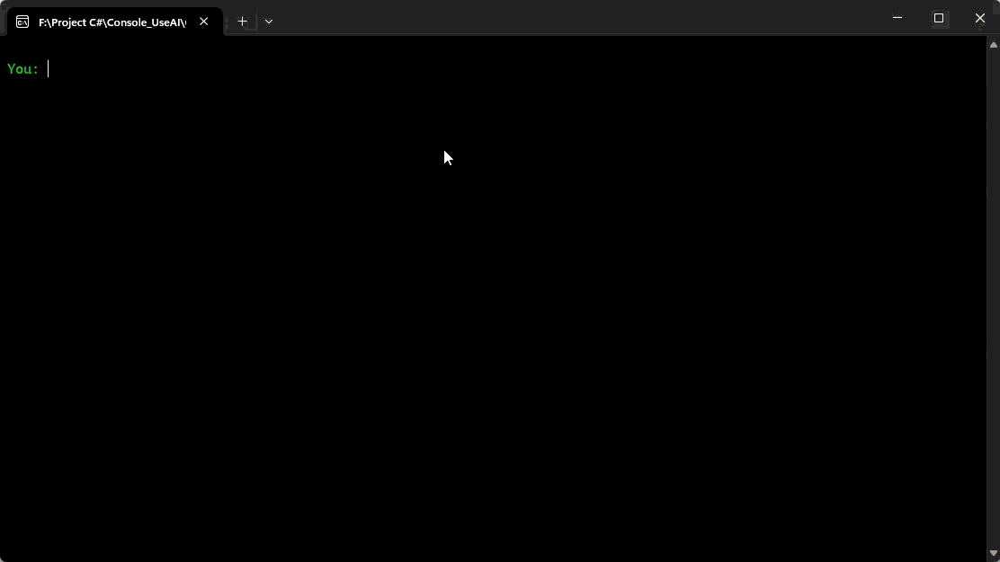

# ConsoleUseAI-CSharp

A lightweight console application that lets you chat with a language-model backend either **online** via Hugging Face Inference API or **offline** through a local server such as LM Studio.

---
Here's the demo video that shows console 


## Features

- Simple user interface
- No need for powerful graphics and hardware
- Fast

## 📦 What you get

- `ConsoleUseAI.exe` – ready-to-run
- Full source code (`Program.cs`, `.csproj`, etc.)  
- Example settings file (`appsettings.example.json`)  

---

## ⚙️ One-time setup

1. **Download / clone**  
   ```bash
   git clone https://github.com/MohammadRasool313/ConsoleUseAI-CSharp.git
   cd ConsoleUseAI-CSharp
   ```

2. **Add your configuration**  
   - Open the included appsettings.json file in the Console_UseAI/ folder.
   - Create or reuse a Hugging Face API token at  
     https://huggingface.co/settings/tokens  
     ❗When you generate the token, make sure to grant the **“Read”** scope (or any additional scopes your model requires). 
   - Fill in the values:

   ```json:
   {
     "AiSettings": {
       "OnlineUrl": "https://router.huggingface.co/novita/v3/openai/chat/completions",
       "LocalUrl": "http://localhost:1234/v1/chat/completions",
       "ActiveModel": "deepseek/deepseek-v3-0324",
       "Online": true,
       "OnlineApiKey": "YOUR_HF_TOKEN",
       "LocalApiKey": ""
     }
   }
   

   *Keep `appsettings.json` out of version control (already ignored).*

---

## 🚀 Quick start

### Option A – Run the EXE (easiest)

1. Navigate to `bin/Release/net8.0` (or the folder containing `ConsoleUseAI.exe`).  
2. Double-click `ConsoleUseAI.exe`.  
3. Start chatting.

### Option B – Build from source

Prerequisites: .NET 8 SDK  
```bash
dotnet restore
dotnet run --project ConsoleUseAI
```

---

## 🌐 Modes

| Mode | Requirements | How to switch |
|------|--------------|---------------|
| **Online** | Hugging Face API token | Set `"Online": true` in `appsettings.json` |
| **Offline** | LM Studio (or any OpenAI-API-compatible server) running on `localhost:1234` | Set `"Online": false` |

---

## 🔐 Security notes

- Never commit your real token.  
- Use environment variables (`HF_API_KEY`) instead of the JSON file if you prefer.

---

## 📄 License

MIT © [MR313](https://github.com/MohammadRasool313)
